# Azure Sentinel Linux Honeypot Lab

## Overview

This project documents a basic SOC lab built with Microsoft Azure and Microsoft Sentinel. The lab uses a Debian 12 Linux virtual machine as an SSH honeypot to collect real authentication attempts from the public Internet.

The VM forwards Linux Syslog authentication logs to a Log Analytics Workspace using Azure Monitor Agent and a Data Collection Rule. Microsoft Sentinel is then used to analyze the logs with KQL and visualize attacker source locations in a custom Sentinel Workbook attack map.

## Project Goal

The goal of this lab is to practice core SOC skills in a controlled cloud environment:

- Deploying a Linux honeypot in Azure.
- Exposing SSH intentionally through TCP/22.
- Collecting Linux authentication logs with Syslog.
- Forwarding logs to Microsoft Sentinel.
- Using KQL to analyze SSH activity.
- Extracting attacker IP addresses from `sshd` logs.
- Creating a Sentinel Workbook attack map.
- Preparing the lab for future detections and analytic rules.

## Repository Description

Microsoft Sentinel SOC lab using a Debian SSH honeypot, Syslog via AMA, KQL, GeoIP enrichment, and a Sentinel Workbook attack map to analyze real-world SSH authentication attempts.

## Architecture

```mermaid
flowchart LR
    A[Public Internet / Attackers] --> B[Azure Network Security Group<br>Allow TCP/22]
    B --> C[Debian 12 Honeypot VM<br>OpenSSH Server]
    C --> D[Linux Syslog<br>sshd Authentication Logs]
    D --> E[Azure Monitor Agent]
    E --> F[Data Collection Rule<br>LOG_AUTH / LOG_AUTHPRIV]
    F --> G[Log Analytics Workspace<br>Syslog Table]
    G --> H[Microsoft Sentinel]
    H --> I[KQL Queries]
    I --> J[GeoIP Enrichment<br>geo_info_from_ip_address]
    J --> K[Sentinel Workbook<br>SSH Attack Map]
```

## Tools and Services Used

- Microsoft Azure
- Microsoft Sentinel
- Log Analytics Workspace
- Azure Monitor Agent
- Data Collection Rules
- Debian 12 Bookworm
- OpenSSH Server
- Syslog / rsyslog
- KQL
- Microsoft Sentinel Workbooks

## Lab Summary

The original lab idea was based on a Windows honeypot using Windows Security Events and Event ID `4625`. Due to Azure student subscription limitations, the lab was adapted to Linux using Debian 12.

Instead of using the `SecurityEvent` table, this lab uses the `Syslog` table. SSH authentication events generated by `sshd` are collected and analyzed in Microsoft Sentinel.

The main SSH log patterns analyzed were:

- `Invalid user`
- `Connection closed by invalid user`
- `Connection reset by invalid user`
- `Failed password`

## Implementation Phases

### 1. Azure Environment Setup

A dedicated Azure resource group was created to isolate the lab resources. A Debian 12 virtual machine was deployed as the honeypot.

### 2. SSH Honeypot Exposure

The Network Security Group was configured to allow inbound SSH traffic over TCP/22 from the public Internet.

### 3. Local Log Verification

SSH activity was verified locally on the Debian VM using `journalctl` before forwarding logs to Microsoft Sentinel.

### 4. Log Forwarding

The `Syslog via AMA` connector was configured in Microsoft Sentinel. A Data Collection Rule was created to collect Linux authentication logs from the Debian VM.

### 5. KQL Analysis

KQL queries were used to identify SSH authentication attempts, extract attacker IP addresses, and summarize activity by source IP.

### 6. Attack Map Visualization

A Microsoft Sentinel Workbook was created to visualize attacker source locations on a map using IP geolocation enrichment.

## KQL Queries

The full KQL queries are stored in the `kql/ssh/` folder.

| Query File | Purpose |
|---|---|
| [ssh-authentication-events.kql](kql/ssh/ssh-authentication-events.kql) | View SSH authentication events from Syslog |
| [ssh-attacker-ip-summary.kql](kql/ssh/ssh-attacker-ip-summary.kql) | Extract and summarize attacker IP addresses |
| [ssh-geoip-attack-map.kql](kql/ssh/ssh-geoip-attack-map.kql) | Enrich attacker IPs with geolocation data for the attack map |

## Results

The honeypot successfully collected real SSH authentication activity from public IP addresses. Microsoft Sentinel received the logs through the `Syslog` table, and KQL was used to extract and summarize attacker IP activity.

A Microsoft Sentinel Workbook was created to visualize attacker source locations on a geographic map.

## Screenshots

Screenshots are stored in the `screenshots/` folder.

| Evidence | Screenshot |
|---|---|
| Resource group | [01-resource-group.png](screenshots/01-resource-group.png) |
| Debian VM | [02-debian-vm-created.png](screenshots/02-debian-vm-created.png) |
| NSG SSH rule | [03-network-security-group-ssh-rule.png](screenshots/03-network-security-group-ssh-rule.png) |
| SSH service running | [04-ssh-service-running.png](screenshots/04-ssh-service-running.png) |
| Local SSH logs | [05-local-ssh-invalid-user-events.png](screenshots/05-local-ssh-invalid-user-events.png) |
| Log Analytics Workspace | [06-log-analytics-workspace.png](screenshots/06-log-analytics-workspace.png) |
| Microsoft Sentinel enabled | [07-sentinel-enabled.png](screenshots/07-sentinel-enabled.png) |
| Syslog via AMA connector | [08-syslog-via-ama-connector.png](screenshots/08-syslog-via-ama-connector.png) |
| Data Collection Rule | [09-data-collection-rule.png](screenshots/09-data-collection-rule.png) |
| Sentinel Syslog query | [10-sentinel-syslog-query.png](screenshots/10-sentinel-syslog-query.png) |
| Attacker IP summary | [11-attacker-ip-summary-kql.png](screenshots/11-attacker-ip-summary-kql.png) |
| Attack map | [12-sentinel-ssh-attack-map.png](screenshots/12-sentinel-ssh-attack-map.png) |

## Security Considerations

This honeypot was intentionally exposed to the public Internet for educational and defensive security purposes. The VM was isolated from production resources and did not contain sensitive information.

Before publishing screenshots, sensitive information such as public IP addresses, usernames, subscription IDs, tenant IDs, and resource IDs should be removed or censored.

After collecting enough data, the VM should be stopped and deallocated to reduce cost and exposure.

## Future Improvements

- Create Microsoft Sentinel analytic rules for SSH brute-force detection.
- Detect multiple invalid usernames from the same source IP.
- Detect successful SSH logins after repeated failures.
- Add severity classification for suspicious source IPs.
- Add additional Sentinel Workbooks.
- Add SOAR playbooks for automated notifications.
- Expand the lab with additional Linux log sources.

## Disclaimer

This project was created for educational and defensive security purposes only. It should not be used to attack, disrupt, or access systems without authorization.
