# Azure Sentinel Linux Honeypot Lab

## Overview

This project documents the deployment of a Linux-based SSH honeypot in Microsoft Azure using Debian 12. The honeypot was intentionally exposed to the public Internet through TCP/22 in a controlled lab environment to collect real SSH authentication activity.

Linux Syslog events generated by `sshd` were collected using Azure Monitor Agent and a Data Collection Rule, forwarded to a Log Analytics Workspace, and analyzed in Microsoft Sentinel using KQL. The collected attacker IP addresses were extracted, summarized, enriched with geolocation data, and visualized in a custom Microsoft Sentinel Workbook attack map.

## Repository Description

A Microsoft Sentinel SOC lab using a Debian SSH honeypot, Syslog via AMA, KQL queries, GeoIP enrichment, and a Sentinel Workbook attack map to analyze real-world SSH authentication attempts.

## Objective

The main goal of this lab was to build a basic SOC-style monitoring environment capable of:

- Deploying a public-facing Linux honeypot in Azure.
- Collecting SSH authentication activity through Syslog.
- Forwarding Linux logs to Microsoft Sentinel.
- Using KQL to identify suspicious SSH authentication attempts.
- Extracting attacker IP addresses from `sshd` logs.
- Enriching source IP addresses with geolocation data.
- Creating a Microsoft Sentinel Workbook attack map.
- Preparing the repository structure for future detection engineering work.

## Architecture

```mermaid
flowchart LR
    A[Public Internet / External Attackers] --> B[Azure Network Security Group<br>Allow TCP/22]
    B --> C[Debian 12 Honeypot VM<br>OpenSSH Server]
    C --> D[Linux Syslog<br>sshd Authentication Logs]
    D --> E[Azure Monitor Agent]
    E --> F[Data Collection Rule<br>LOG_AUTH / LOG_AUTHPRIV]
    F --> G[Log Analytics Workspace<br>Syslog Table]
    G --> H[Microsoft Sentinel]
    H --> I[KQL Detection Queries]
    I --> J[GeoIP Enrichment<br>geo_info_from_ip_address]
    J --> K[Sentinel Workbook<br>SSH Attack Map]
```



## Lab Context

The original project concept was based on a Windows honeypot using Windows Security Events and Event ID `4625` for failed logon attempts. Due to subscription limitations, the implementation was adapted to a Linux-based environment using Debian 12.

Instead of collecting Windows `SecurityEvent` logs, this lab collects Linux `Syslog` events generated by OpenSSH. Events such as `Invalid user`, `Connection closed by invalid user`, `Connection reset by invalid user`, and `Failed password` were used to identify SSH authentication attempts.

This adaptation demonstrates how a SOC lab can be modified based on available resources while preserving the original security monitoring objective.

## Tools and Services Used

- Microsoft Azure
- Microsoft Sentinel
- Log Analytics Workspace
- Azure Monitor Agent
- Data Collection Rules
- Debian 12 Bookworm
- OpenSSH Server
- Syslog / rsyslog
- KQL
- Microsoft Sentinel Workbooks

## Implementation Summary

### 1. Azure Environment

A dedicated Azure resource group was created to isolate the lab resources. Inside this environment, a Debian 12 virtual machine was deployed as the honeypot.

### 2. Honeypot Exposure

The Network Security Group was configured to allow inbound SSH traffic over TCP/22. This allowed the VM to receive authentication attempts from the public Internet.

### 3. Local SSH Logging

The OpenSSH service was enabled on the Debian VM. Authentication-related events were verified locally using `journalctl`, confirming that the honeypot was receiving real-world SSH activity.

Example local log patterns included:

```text
Invalid user ubuntu from <source-ip>
Invalid user debian from <source-ip>
Connection closed by invalid user <username> from <source-ip>
Connection reset by invalid user <username> from <source-ip>
```

### 4. Log Forwarding to Microsoft Sentinel

The `Syslog via AMA` connector was configured in Microsoft Sentinel. A Data Collection Rule was created to collect Linux authentication logs from the Debian VM.

The relevant facilities used were:

- `LOG_AUTH`
- `LOG_AUTHPRIV`

The logs were forwarded into the Log Analytics Workspace and became available in the `Syslog` table.

### 5. KQL Analysis

KQL was used to query SSH authentication activity, extract attacker IP addresses, summarize attempts, and prepare the data for visualization.

### 6. Attack Map Workbook

A Microsoft Sentinel Workbook was created to visualize attacker source locations on a map. Since a Sentinel Watchlist could not be created in this environment, geolocation enrichment was performed directly in KQL using `geo_info_from_ip_address()`.

## Key KQL Queries

### SSH Authentication Events

```kql
Syslog
| where TimeGenerated > ago(30d)
| where ProcessName has "sshd"
| where SyslogMessage has_any (
    "Invalid user",
    "Connection closed by invalid user",
    "Connection reset by invalid user",
    "Failed password"
)
| project TimeGenerated, HostName, ProcessName, SyslogMessage
| sort by TimeGenerated desc
```

### Attacker IP Summary

```kql
Syslog
| where TimeGenerated > ago(30d)
| where ProcessName has "sshd"
| where SyslogMessage has_any (
    "Invalid user",
    "Connection closed by invalid user",
    "Connection reset by invalid user",
    "Failed password"
)
| extend AttackerIp = coalesce(
    extract(@"from\s+((?:\d{1,3}\.){3}\d{1,3})", 1, SyslogMessage),
    extract(@"invalid user\s+\S+\s+((?:\d{1,3}\.){3}\d{1,3})\s+port", 1, SyslogMessage)
)
| where isnotempty(AttackerIp)
| summarize Attempts=count() by AttackerIp
| sort by Attempts desc
```

### GeoIP Enrichment for Attack Map

```kql
Syslog
| where TimeGenerated > ago(30d)
| where ProcessName has "sshd"
| where SyslogMessage has_any (
    "Invalid user",
    "Connection closed by invalid user",
    "Connection reset by invalid user",
    "Failed password"
)
| extend AttackerIp = coalesce(
    extract(@"from\s+((?:\d{1,3}\.){3}\d{1,3})", 1, SyslogMessage),
    extract(@"invalid user\s+\S+\s+((?:\d{1,3}\.){3}\d{1,3})\s+port", 1, SyslogMessage)
)
| where isnotempty(AttackerIp)
| extend geo = geo_info_from_ip_address(AttackerIp)
| extend
    country = tostring(geo.country),
    state = tostring(geo.state),
    city = tostring(geo.city),
    latitude = todouble(geo.latitude),
    longitude = todouble(geo.longitude)
| where isnotempty(latitude) and isnotempty(longitude)
| summarize FailureCount = count()
    by AttackerIp, latitude, longitude, city, country
| extend friendly_location = strcat(city, " (", country, ")")
| project FailureCount, AttackerIp, latitude, longitude, city, country, friendly_location
```

## Results

The honeypot successfully collected SSH authentication activity from public IP addresses. Microsoft Sentinel received the events through the `Syslog` table, and KQL was used to extract attacker IP addresses and summarize the number of attempts per source.

The final Microsoft Sentinel Workbook visualized SSH authentication attempts on a geographic map using IP geolocation enrichment.

## Security Considerations

This lab intentionally exposed SSH to the public Internet for research and learning purposes. The honeypot was isolated from production resources and did not contain sensitive data.

After collecting enough data, the VM was stopped and deallocated to reduce cost and exposure.

Sensitive information such as subscription IDs, public IP addresses, usernames, resource IDs, and SSH keys should be removed or censored before publishing screenshots.

## Future Improvements

Planned improvements include:

- Creating Microsoft Sentinel analytic rules for SSH brute-force behavior.
- Detecting multiple invalid usernames from the same source IP.
- Detecting successful SSH logins after repeated failures.
- Adding severity classification based on source IP activity.
- Creating additional Sentinel Workbooks.
- Adding SOAR playbooks for automated notifications.
- Testing additional Linux log sources beyond SSH.
- Adding infrastructure-as-code templates for repeatable deployment.

## Lessons Learned

- Microsoft Sentinel can ingest Linux authentication logs through Syslog via AMA.
- Debian-based honeypots can provide useful telemetry for SOC-style labs.
- KQL can extract attacker IPs from raw SSH log messages.
- Geolocation enrichment can be performed directly in KQL without a watchlist.
- A lab originally designed for Windows can be successfully adapted to Linux while preserving the detection and monitoring objective.

## Disclaimer

This project was created for educational and defensive security purposes only. The honeypot was deployed in a controlled lab environment and should not be connected to sensitive systems or production networks.
