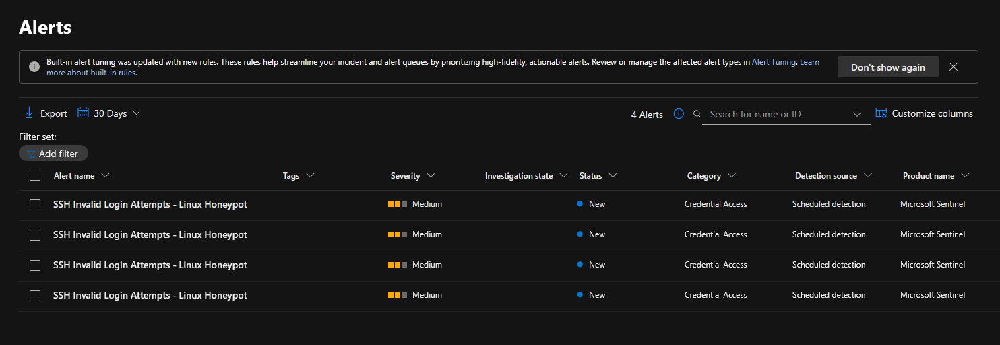

# Microsoft Sentinel Analytics Rule: SSH Invalid Login Attempts - Linux Honeypot

## Overview

This analytics rule detects suspicious SSH authentication activity against the Debian Linux honeypot. The rule searches Linux Syslog events collected from the honeypot through **Syslog via AMA** and identifies SSH login attempts such as invalid usernames, failed passwords, and connections closed or reset during authentication.

## Rule Summary

| Field | Value |
|---|---|
| Rule name | SSH Invalid Login Attempts - Linux Honeypot |
| Rule type | Scheduled query rule |
| Severity | Medium |
| Data source | Syslog |
| Detection source | Microsoft Sentinel scheduled detection |
| Platform | Debian 12 / Linux |
| Service | OpenSSH Server |
| MITRE ATT&CK tactic | Credential Access |
| MITRE ATT&CK technique | Brute Force / Password Guessing |

## Purpose

The goal of this rule is to generate Microsoft Sentinel alerts when the honeypot receives SSH authentication attempts from external IP addresses.

This rule helps identify:

- Invalid SSH username attempts.
- Failed SSH password attempts.
- Source IPs attempting to authenticate to the honeypot.
- Repeated SSH activity from the same external IP address.

## KQL Query

```kql
Syslog
| where TimeGenerated > ago(30d)
| where ProcessName has "sshd"
| where SyslogMessage has_any (
    "Invalid user",
    "Connection closed by invalid user",
    "Connection reset by invalid user",
    "Failed password"
)
| extend AttackerIp = coalesce(
    extract(@"from\s+((?:\d{1,3}\.){3}\d{1,3})", 1, SyslogMessage),
    extract(@"invalid user\s+\S+\s+((?:\d{1,3}\.){3}\d{1,3})\s+port", 1, SyslogMessage)
)
| where isnotempty(AttackerIp)
| project TimeGenerated, AttackerIp, HostName, Computer, ProcessName, SyslogMessage
```

## Rule Configuration

Recommended configuration for testing:

| Setting | Value |
|---|---|
| Run query every | 5 minutes |
| Lookup data from the last | 1 hour |
| Alert threshold | Greater than 0 |
| Event grouping | Trigger an alert for each event |
| Incident creation | Enabled |
| Alert suppression | Disabled |

## Entity Mapping

Recommended entity mapping:

| Entity Type | Identifier | Column |
|---|---|---|
| IP | Address | AttackerIp |
| Host | HostName | HostName |

If `HostName` is not available in your environment, use `Computer` as the host identifier.

## Incident Settings

Enable incident creation:

```text
Create incidents from alerts triggered by this analytics rule: Enabled
```

This allows Sentinel to create incidents from the generated alerts so they can be reviewed in the incident queue.

## Expected Alert Output

When the rule triggers, the alert should include:

- Source IP address of the SSH attempt.
- Honeypot hostname.
- Original SSH log message.
- Timestamp of the event.
- Process name, usually `sshd`.

Example log message:

```text
Invalid user ubuntu from <source-ip> port <port-number>
```

## Validation Steps

1. Confirm the Debian VM is running.
2. Confirm SSH is exposed through TCP/22.
3. Generate or wait for SSH authentication attempts.
4. Validate that events appear in Sentinel:

```kql
Syslog
| where TimeGenerated > ago(1h)
| where ProcessName has "sshd"
| project TimeGenerated, HostName, ProcessName, SyslogMessage
| sort by TimeGenerated desc
```

5. Confirm the analytics rule is enabled.
6. Wait for the scheduled rule to run.
7. Check Microsoft Sentinel alerts and incidents.

## Troubleshooting

If the alert does not trigger:

| Issue | Check |
|---|---|
| Query returns no results | Run the KQL query manually in Logs |
| Rule disabled | Confirm the analytics rule status is Enabled |
| No recent events | Generate a new SSH attempt or increase the lookback window |
| Alert threshold too high | Use `Greater than 0` while testing |
| Incident missing | Confirm incident creation is enabled |
| Alerts delayed | Wait for the scheduled query interval to complete |
| Wrong table | Use `Syslog`, not `SecurityEvent` |

## Tuning Recommendations

For initial testing, the rule can trigger on any SSH authentication attempt.

For a more realistic production-style threshold, modify the query to summarize attempts by IP and alert only when a source exceeds a threshold.

Example tuned version:

```kql
Syslog
| where TimeGenerated > ago(30d)
| where ProcessName has "sshd"
| where SyslogMessage has_any (
    "Invalid user",
    "Connection closed by invalid user",
    "Connection reset by invalid user",
    "Failed password"
)
| extend AttackerIp = coalesce(
    extract(@"from\s+((?:\d{1,3}\.){3}\d{1,3})", 1, SyslogMessage),
    extract(@"invalid user\s+\S+\s+((?:\d{1,3}\.){3}\d{1,3})\s+port", 1, SyslogMessage)
)
| where isnotempty(AttackerIp)
| summarize Attempts=count(), FirstSeen=min(TimeGenerated), LastSeen=max(TimeGenerated)
    by AttackerIp, HostName, Computer
| where Attempts >= 5
| project FirstSeen, LastSeen, AttackerIp, HostName, Computer, Attempts
```

Suggested production-style threshold:

```text
Attempts >= 5 within 1 hour
```

## Recommended Response

When this alert is triggered:

1. Review the source IP address.
2. Check how many attempts came from the same IP.
3. Review the usernames attempted.
4. Confirm whether any successful SSH login occurred after the failed or invalid attempts.
5. Determine whether the source should be blocked or monitored.
6. Document the incident outcome.

## Notes

This rule was created for a controlled honeypot lab environment. Since the VM is intentionally exposed to the public Internet, some SSH authentication attempts are expected.

The purpose of the rule is to demonstrate the full SOC workflow:

```text
Honeypot -> Syslog -> Sentinel -> KQL -> Analytics Rule -> Alert / Incident
```

## Screenshot Evidence

The following screenshot shows the Microsoft Sentinel alerts generated by this analytics rule:



[Open screenshot](../screenshots/13-sentinel-alerts-generated.png)
